# Welcome to [motorbikebuddy.com](https://ricardoit-web.github.io/motorbikebuddy.com/) A Social Networking Website for Motorbike Enthusiasts

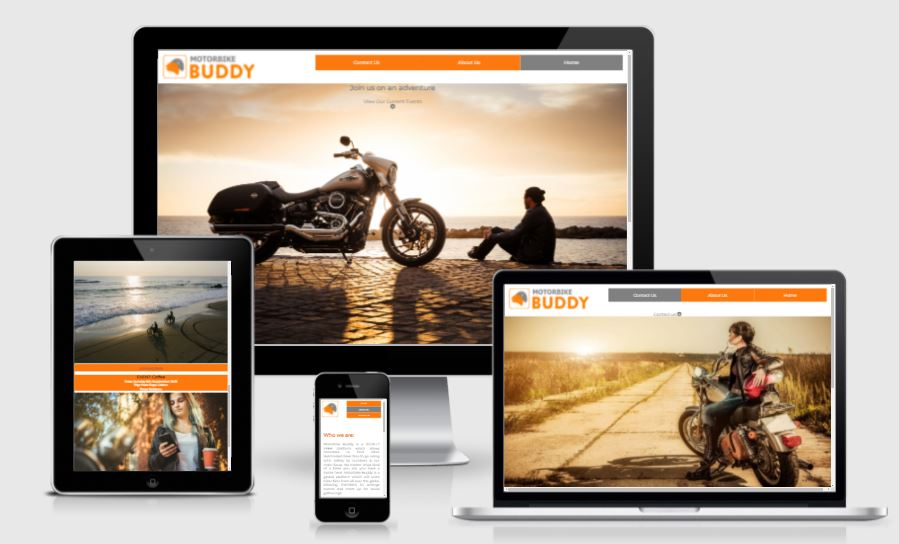

This project was developed to satisfy the first Milestone Project requirements of the Full Stack Web Development Program at the [Code Institute](https://www.codeinstitute.net). As a first project, this site is created using HTML5 and CSS3 languages.

The purpose of this Social Networking website is to provide a platform for motorbike fans around the world to arrange gatherings of short trips, touring holidays and arrange related events where bikers can come together and experience memorable adventures.

## Table of Contents
* [User Stories](User-Stories)
* [Features](Features)
* [Future Features](Future-Features)
* [Wireframes](Wireframes)
* [Typography and Color schemes](Typography-and-Color-schemes)
* [Testing](Testing)
* [Unfixed Bugs](Unfixed-Bugs)
* [Deployment](Deployment)
* [Credits](Credits)

# User Stories
## Prospective User

I am a prospective Motorbike buddy site member and I want to be able to:

* Immediately understand the purpose of the motorbikebuddy website.
* Locate the navigation bar and identify what pages are available to me.
* Easily identify currently organised events and request more details via a link readily available to me.
* The link should direct me to the contact us page with a form which will allow me to fill in my contact details and allow the platform owners to respond.
* View information about the owners of the platform and what else the site aims to achieve
* Reach out to the owners of the platform for any questions or concerns about the platform.
* Receive a confirmation notification once I have submitted my questions or concerns.

# Features

### _**The Home Page**_

The first release version of this website will include a home page which will contain a navigation bar at the top, containing the website Logo floated to the left and to the right will include the functionality for the user to view links to the home page, information about the sites objectives and be able to reach out to the platform owners for information.

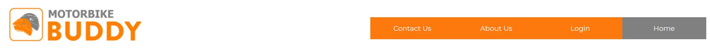

This home page will include a "Hero" image.

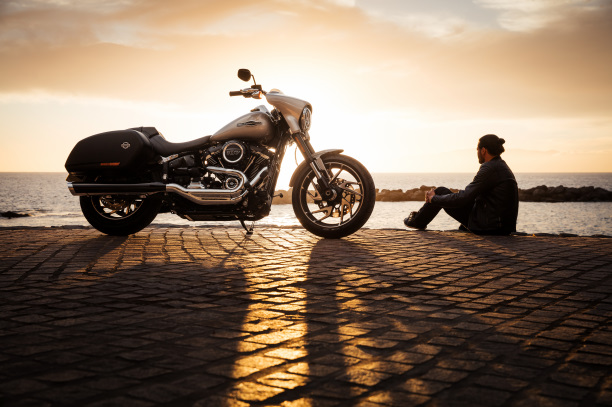

Below the hero image, viewers will identify current events orgainsed and will be able to request information of any event.

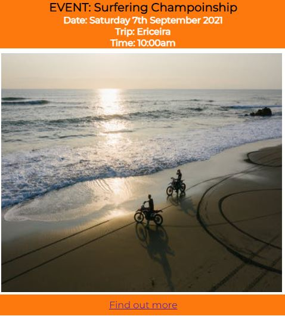

The user is able to find out more details about each event by clicking on the link in the event footer. This link will direct the user to the contact us page where they will be required to fill out some details in order to receive response from the site owners.

Below the events section, the users will see a clickable link which will take the viewer back to the top of the page.

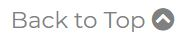

At the bottom of the page the user will identify the footer section which will contain the motorbikebuddy copyright icon to the right together with links to social networking sites including Twiiter, Facebook and Instagram.

The Top navigation bar and the footer sections will be replicated on all pages of this website.

* See "Future Features" in section 4 for whats to come in future releases.

### _**About Us**_

This page will contain a brief description of who the platform owners are and what services they aim to provide members and why.

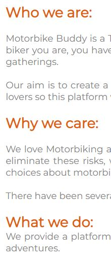

### _**Contact Us Page**_

The contact Us page will allow users to reach out to us for information related to the website. Above the hero image users on larger screens will find a link directing them to the form.

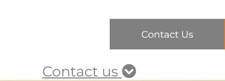

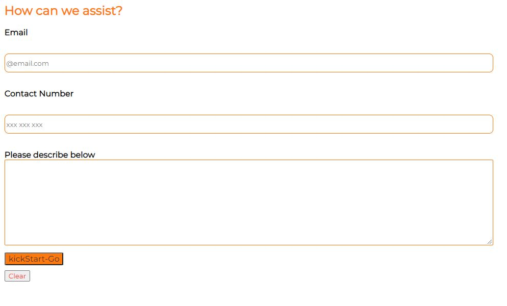

This will be available using a "forms" feature where the user will be encouraged to fill in some 'required' basic information which will allow Owners to revert back to the user, using their preferred method (email or phone call),  with relevant responses. Viewers using large screens will identify a link above the Hero Image to direct the user to the form section below.

See "Future Features" in section 4 for whats to come in future releases.

### _**Confirmation Page**_

Upon submitting the contact us form to the site owners, the users will be directed to a new page. This page will provide the user with assurances that the form has been submitted successfully. This page also contains a link to direct the user back to the home page.

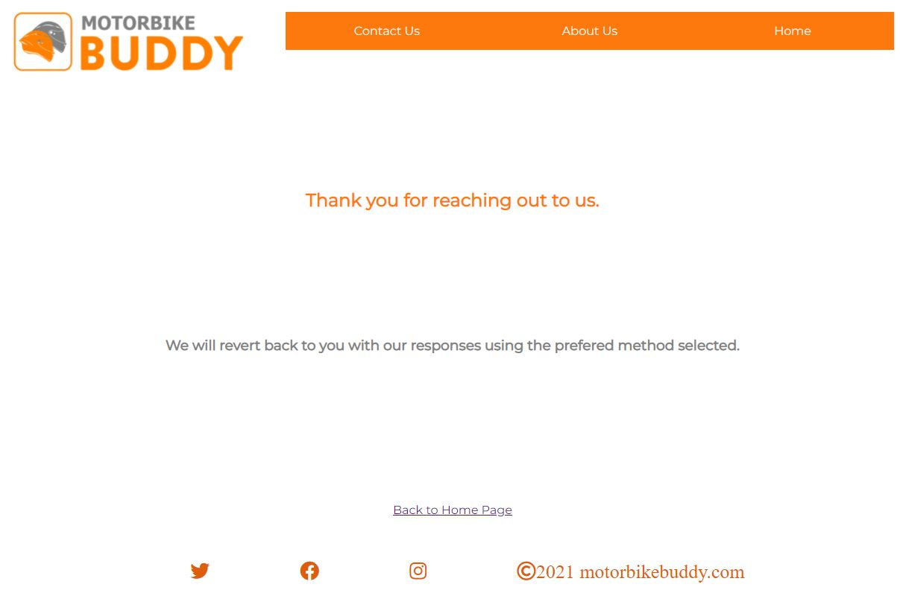

# Future Features

### _**The Home Page**_

In furture releases we aim to add a registration page for prospective members to create a profile and join the platform.

This will be followed by a login feature for existing members to be able to access their profiles.

Owner also aim to include a search feature to the home page, allowing members and prospective users to search for other members near-by.

Owners will also be adding a new page for members and external hosts to organise events, weather that be racing events, touring holidays or large gatherings such as live gigs. 
Once the event is launch, members will be able to sign up but also, if a member is undecided, they will have the option of selecting the "show your interest" button, whereby the host will receive notifications of these member enabling them to send updates of their respective events to interested buddies.

Owners will also add reviews from existing members to the home page allowing other members and prospective users to view this information.

Future releases will also include bar menus on smaller screens to reduce space and include increased number of pages.

### _**About Us **_

Future releases will include  the legal terms and conditions of use of the platform and also a link to "FAQs", Frequently Asked Questions.

# Wireframes

### _**Home Page**_

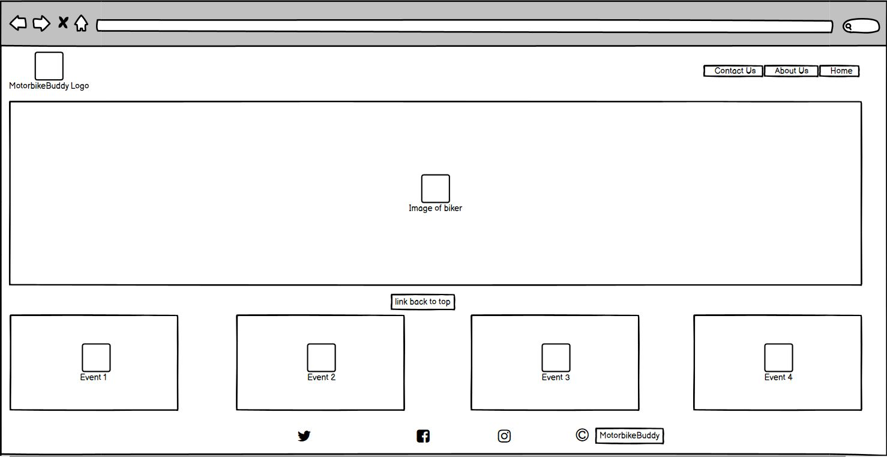

### _**About Us**_

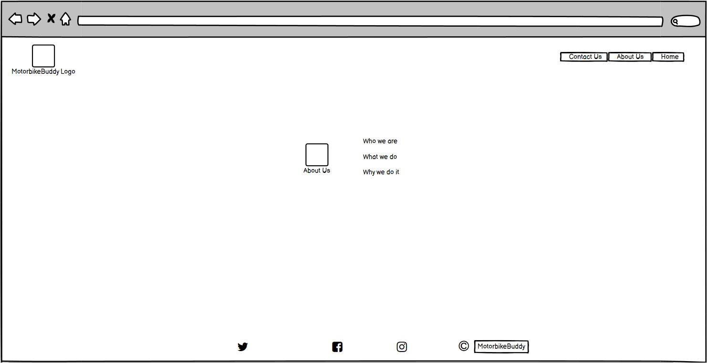

### _**Contact Us Page**_

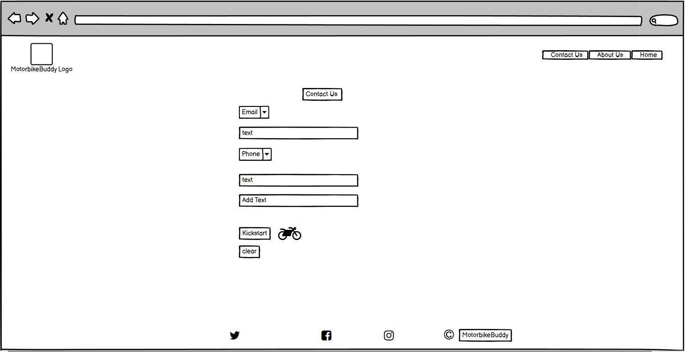

### _**Confirmation Page**_

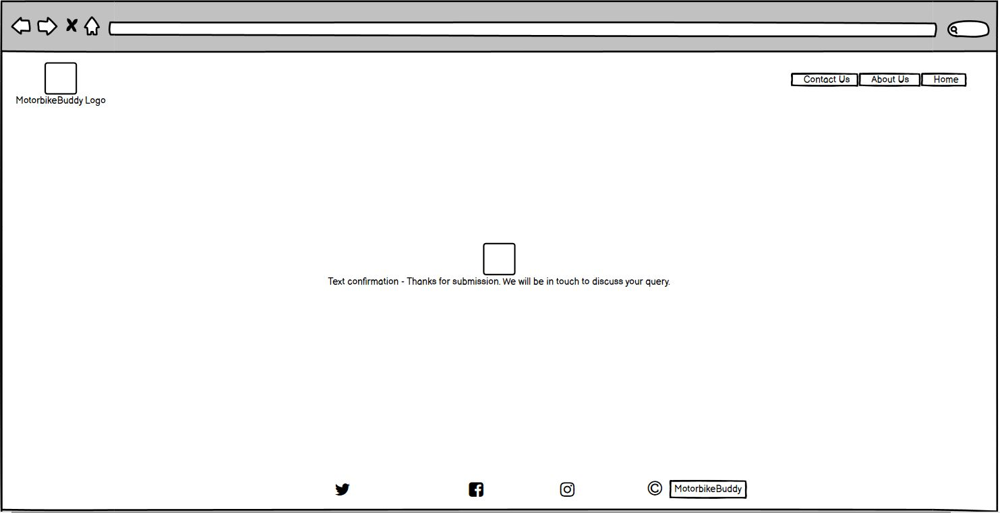

# Typography and Color schemes

The font used throughout this site is Montserrat. Open-sans is used as the fallback font. The Logo is an image so no font required.
The colors used throughout the site have been selected to compliment the logo colors.

# Testing

### _**Validator Testing**_

#### _**HTML - W3C Test**_

* Index Page

Initial errors found as per the below image; All errors resolved by amending viewport values to original Codeinstitute template and by replacing duplicate IDs with Class.

No Errors

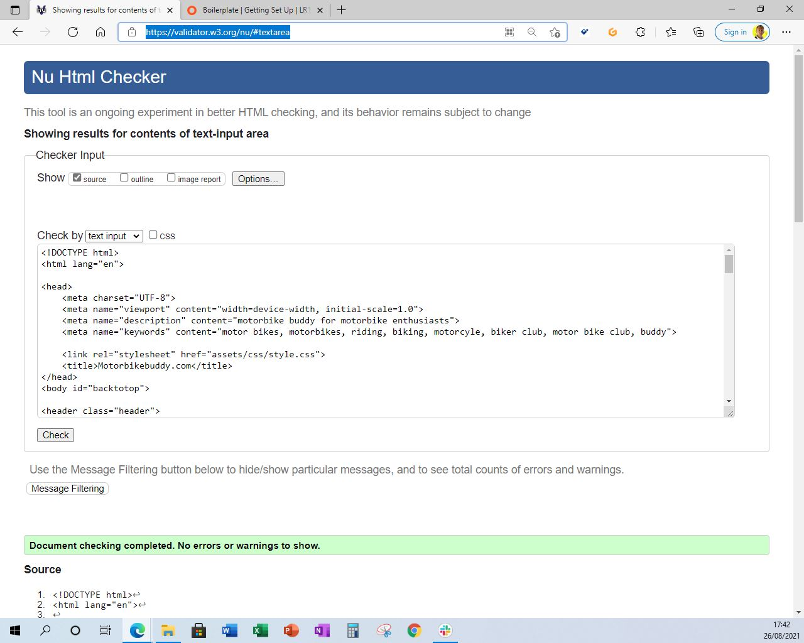

* About Us Page

Initial errors found as per the below image; All errors resolved by amending the alt tag to an aria-label.

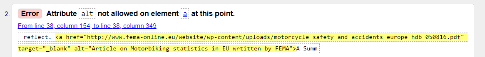

No Errors

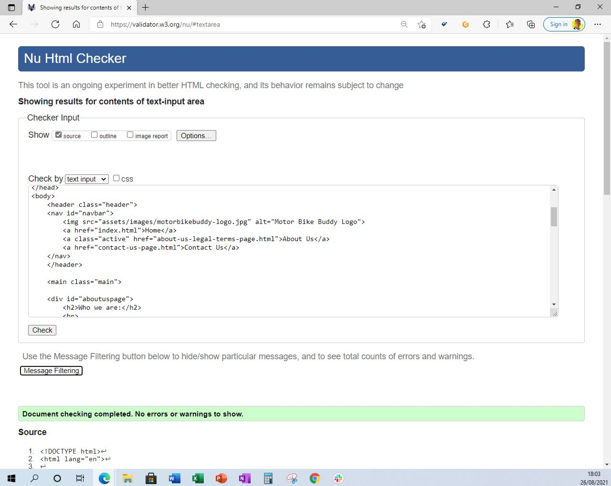

* Contact Us Page

Initial errors identified missing IDs to the email and phone labels. IDs implemented to resolve.

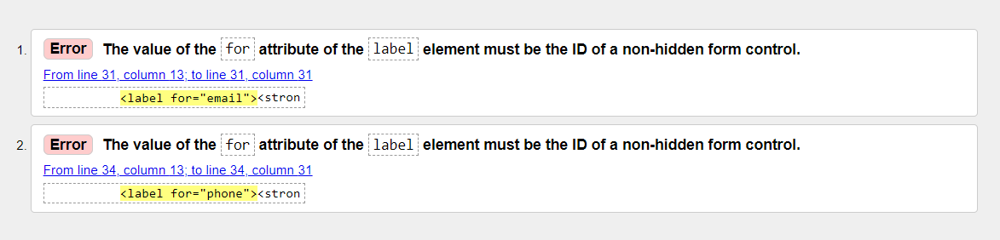

No Errors

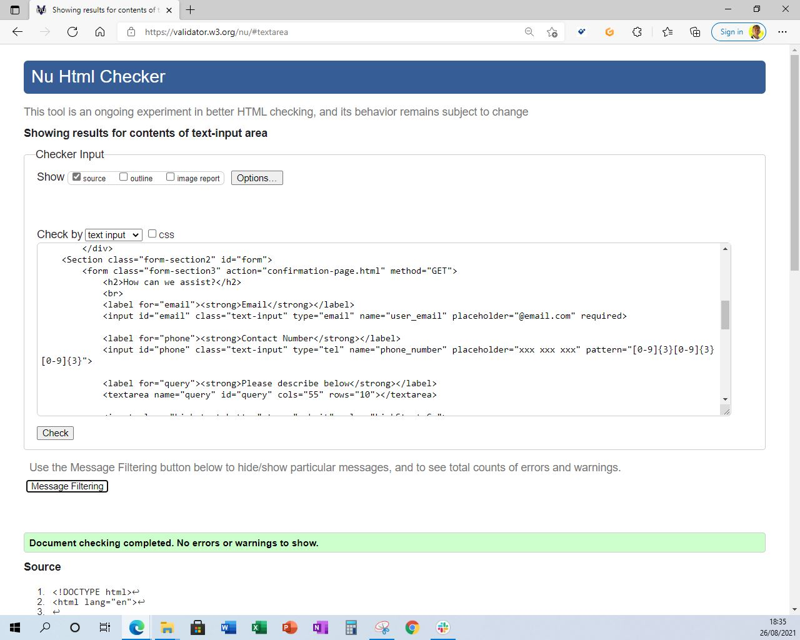

* Confirmation Message Page

No errors identified.

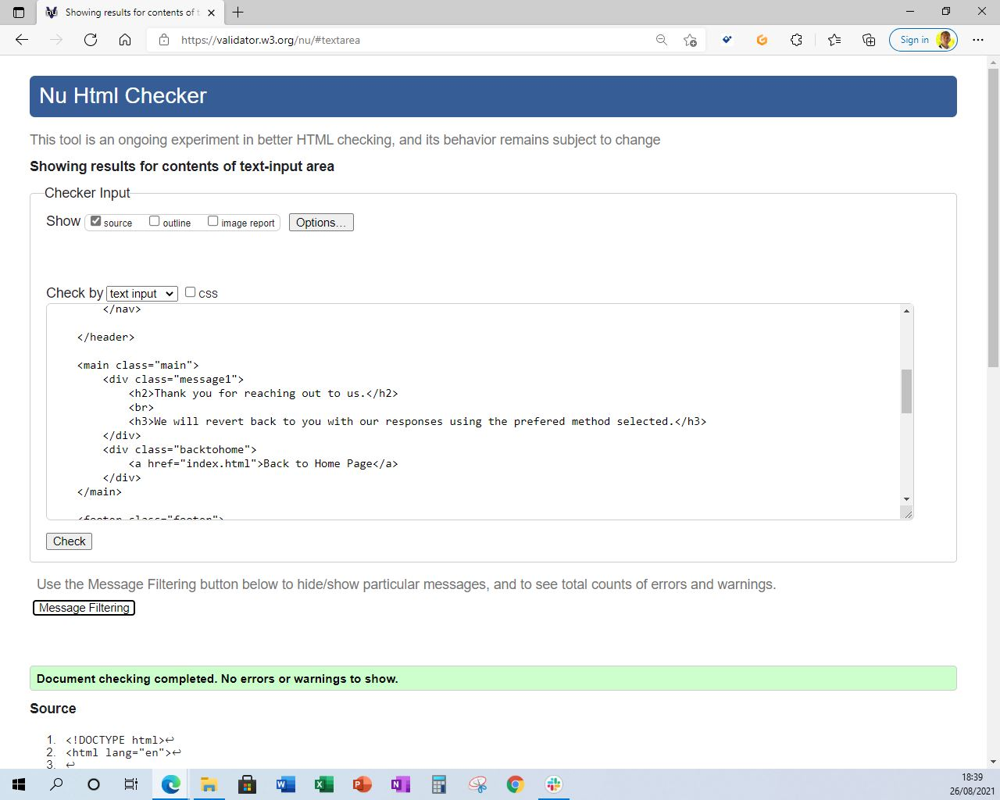

CSS
No errors were found when passing through the official (Jigsaw) validator

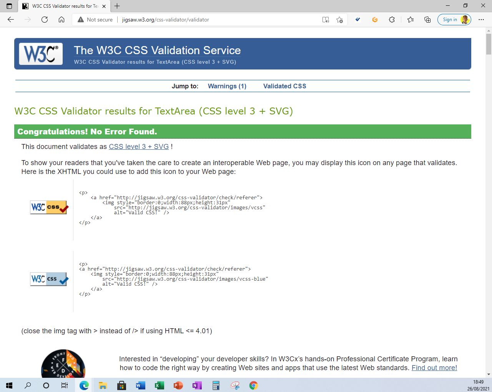

# Unfixed Bugs

# Deployment

# Credits

### _**Content**_

### _**Media**_

