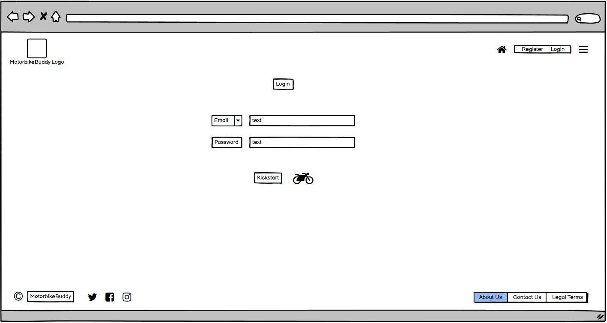
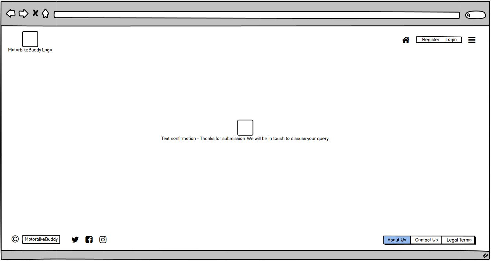

# Welcome to [motorbikebuddy.com](https://ricardoit-web.github.io/motorbikebuddy.com/) A Social Networking Website for Motorbike Enthusiasts

## Table of Contents
* [Purpose of this Project](Purpose-of-this-Project)
* [User Stories](User-Stories)
* [Features](Features)
* [Future Features](Future-Features)
* [Typography and Color schemes](Typography-and-Color-schemes)
* [Testing](Testing)
* [Unfixed Bugs](Unfixed-Bugs)
* [Deployment](Deployment)
* [Credits](Credits)
* [Wireframes](Wireframes)

# Purpose of this Project

The purpose of this Social Networking website is to provide a platform for motorbike fans around the world to arrange gatherings of short trips, touring holidays and arrange related events where bikers can come together and experience memorable adventures. 

* Please refer to the "Features" section below for more details of what this release version will include. 
* Other features in future releases will be included in "Future Features" section.

# User Stories

I am a Motorbike fan and have been for many years. I use my motorbike for leasure only. As a user of this platform I aim to find likeminded biker fans to arrange weekend get togethers and go for short trips around the countryside. I believe in safety by numbers and by arranging trips in groups, we can experience memorable trips whilst supporting eachother along the way. This is a great platform for meeting other like minded bikers looking for similar expereinces. By signing in to this website I am automatically shown memebers near me allowing me to "buddy up" with them.

* I will expect to find a navigation bar where I will identify the website logo and some login and registration functionalities. I will also see a bar menu which will include links to all the web pages so that I will not spend time jumping from one page to the next in order to find the information I require.

* In the middle of the page I will see a "hero" image of bikers having fun riding their bikes. There will be 4 or 5 different images in a loop which will add to my user experience of the home page.

* Below the hero image I will identify card tiles with existing members' reviews of the site and their experiences so far.

* At the bottom of the page I will see the copyright icon together with some buttons with links allowing me to navigate to other pages for more details as required.

# Features

### _**The Home Page**_

The first release version of this website will include a home page which will contain a navigation bar at the top, containing the website Logo floated to the left and to the right will include the functionality for the user to register and to login. There will also be a Home page button and a menu bar which will include all options in all the pages of this website, allowing the user to switch directly to a desired section without needing to navigate to the required page.

This home page will include "Hero" images of bikers, which will change every 15-20 seconds, (max 5 different images in a loop).

Below the hero images, the viewers will see "Card Tiles" which will display members' reviews of their experiences with us and with events they have attended.

At the bottom of the page the user will identify the footer section which will contain the motorbikebuddy copyright icon to the left together with links to our social networking sites including Twiiter, Facebook and Instagram. To the right of the footer section will be button feature allowing the user to navigate to the respective information on other pages.

The Top navigation bar and the footer sections will be replicated on all pages of this website.

See "Future Features" in section 4 for whats to come in future releases.

### _**About Us / Legal Terms Page**_

This page will be split into two sections which will contain a brief description of who we are as owners of this platform and what services we aim to provide our users.

This will also be acompanied by our Legal Terms & Conditions on the same page.

See "Future Features" in section 4 for whats to come in future releases.

### _**Contact Us Page**_

The contact Us page will allow users to reach out to us for any queries or concerns.

This will be available using a "forms" feature where the user will be encouraged to fill in some 'required' basic information which will allow us to revert back to the user, using their preferred method (email or phone call),  with relevant responses.

See "Future Features" in section 4 for whats to come in future releases.

### _**Confirmation Page**_

This page will provide the user who has raised a query in our "Contact Us" page, with a message of thanks for reaching out to us and with further comments to arrange a response back to the user dependent on the contact method chosen.

# Future Features

### _**The Home Page**_

In furture releases we aim to add a search feature to the home page, allowing the user to search for members near-by, potentially with a dotted map view illustrating location of those members.

We will also be adding a feature for members and hosts to organise events, weather that be racing events, touring holidays and large gatherings such as live gigs. 
Once the event is launch, members will be able to sign up but also, if a member is undecided, they will have the option of selecting a "show your interest" button, whereby the host will receive notifications of these member enabling them to send updates of their respective events to interested buddies.

### _**About Us / Legal Terms Page**_

Future releases will include a link to "FAQs", Frequently Asked Questions.

### _**Contact Us Page**_

Future releases will include a link to "FAQs", Frequently Asked Questions.

### _**Confirmation Page**_

Future releases will include a link to "FAQs", Frequently Asked Questions.

# Typography and Color schemes

# Testing

### _**Validator Testing**_

HTML
No errors were returned when passing through the official W3C validator

CSS
No errors were found when passing through the official (Jigsaw) validator

# Unfixed Bugs

# Deployment

# Credits

### _**Content**_

### _**Media**_

# Wireframes

### _**Home Page**_

### _**Login Page**_

### _**About Us & Legal Terms Page**_

### _**Contact Us Page**_

### _**Confirmation Page**_

