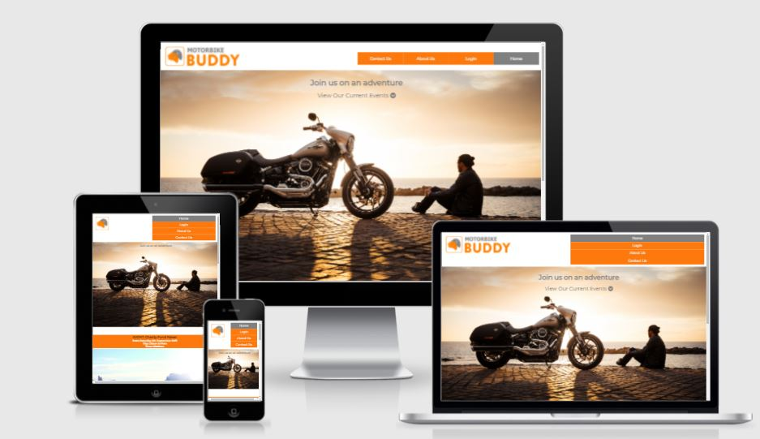
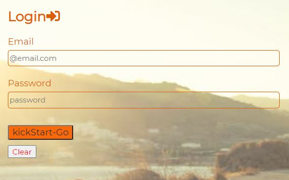

# Welcome to [motorbikebuddy.com](https://ricardoit-web.github.io/motorbikebuddy.com/) A Social Networking Website for Motorbike Enthusiasts

This project was developed to satisfy the first Milestone Project requirements of the Full Stack Web Development Program at the [Code Institute](https://www.codeinstitute.net). As a first project, this site was created using HTML5 and CSS3 languages.

The purpose of this Social Networking website is to provide a platform for motorbike fans around the world to arrange gatherings of short trips, touring holidays and arrange related events where bikers can come together and experience memorable adventures.

## Table of Contents
* [User Stories](User-Stories)
* [Features](Features)
* [Future Features](Future-Features)
* [Wireframes](Wireframes)
* [Typography and Color schemes](Typography-and-Color-schemes)
* [Testing](Testing)
* [Unfixed Bugs](Unfixed-Bugs)
* [Deployment](Deployment)
* [Credits](Credits)

# User Stories
## Prospective User

I am a prospective Motorbike buddy site member and I want to be able to:

* Immediately understand the purpose of the motorbikebuddy website.
* Locate the navigation bar.
* Login in to the site.
* View information about the owners of the platform.
* Reach out to the owners of the platform for any questions or concerns about the platform.
* Easily see what current events are available.

## Existing User

I am an existing Motorbike buddy site member and I want to be able to:

* Login in to my personal profile.
* View current events that might interest me.
* Subscribe to any event I may wish to join in.
* View information about the owners of the platform.
* Reach out to the owners of the platform for any questions or concerns.
* Receive a confirmation notification once I have submitted my questions or concerns.

# Features

### _**The Home Page**_

The first release version of this website will include a home page which will contain a navigation bar at the top, containing the website Logo floated to the left and to the right will include the functionality for the user to login, view information about the sites objectives and be able to reach out to the platform owners if required.

This home page will include a "Hero" image.

Below the hero image, viewers will identify current events orgainsed and will be able to subscribe to any event of their choosing.

Below the events section, the users will see a link which will take the viewer back to the top of the page.

At the bottom of the page the user will identify the footer section which will contain the motorbikebuddy copyright icon to the right together with links to social networking sites including Twiiter, Facebook and Instagram.

The Top navigation bar and the footer sections will be replicated on all pages of this website.

* See "Future Features" in section 4 for whats to come in future releases.

### _**Login Page**_

This release will include a login page which will allow the user to insert their username and password. After clicking the kickstart-go button, the user will be routed back to the home page. There will also be a clear button if the user wishes to clear the form.

Future releases will include a personal profile page allowing the user to carry out other functions as described in the future features section.

### _**About Us**_

This page will contain a brief description of who the platform owners are and what services they aim to provide members and why.

See "Future Features" in section 4 for whats to come in future releases.

### _**Contact Us Page**_

The contact Us page will allow users to reach out to us for any queries or concerns.

This will be available using a "forms" feature where the user will be encouraged to fill in some 'required' basic information which will allow us to revert back to the user, using their preferred method (email or phone call),  with relevant responses. Viewers using large screens will identify a link at the top of the page to diirect the user to the form section below the image.

See "Future Features" in section 4 for whats to come in future releases.

### _**Confirmation Page**_

This page will provide the user some reassurances that the form has been submitted successfully.

# Future Features

### _**The Home Page**_

In furture releases we aim to add a search feature to the home page, allowing the user to search for members near-by, potentially with a dotted map view illustrating location of those members.

We will also be adding a feature for members and hosts to organise events, weather that be racing events, touring holidays and large gatherings such as live gigs. 
Once the event is launch, members will be able to sign up but also, if a member is undecided, they will have the option of selecting a "show your interest" button, whereby the host will receive notifications of these member enabling them to send updates of their respective events to interested buddies.

### _**About Us / Legal Terms Page**_

Future releases will include a link to "FAQs", Frequently Asked Questions.

### _**Contact Us Page**_

Future releases will include a link to "FAQs", Frequently Asked Questions.

### _**Confirmation Page**_

Future releases will include a link to "FAQs", Frequently Asked Questions.

# Typography and Color schemes

# Testing

### _**Validator Testing**_

HTML
No errors were returned when passing through the official W3C validator

CSS
No errors were found when passing through the official (Jigsaw) validator

# Unfixed Bugs

# Deployment

# Credits

### _**Content**_

### _**Media**_

# Wireframes

### _**Home Page**_

### _**Login Page**_

### _**About Us & Legal Terms Page**_

### _**Contact Us Page**_

### _**Confirmation Page**_

